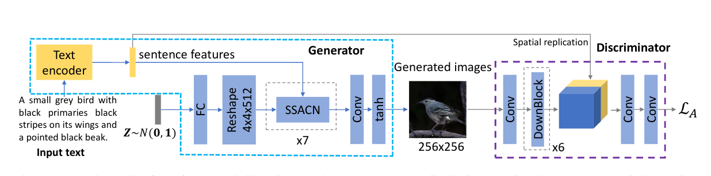
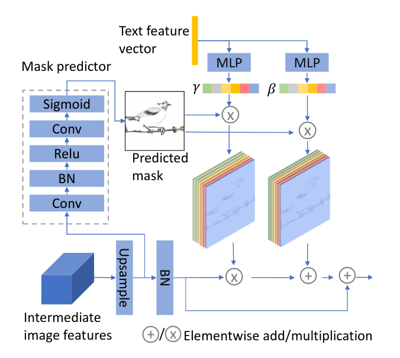

# SSA-GAN
Implementation of the paper Text to Image Generation with Semantic-Spatial Aware GAN

# text to image generation 
<p align="center"> 
  
  <h3 align="center">
    The structure of the semantic spatial aware GAN  
  </h3>  
</p>

<p align="center"> 
  
  <h3 align="center">
    The structure of the semantic spatial aware convolunal network  
  </h3>  
</p>


---
---
# abstract (papper)

A text to image generation (T2I) model aims to gener-ate  photo-realistic  images  which  are  semantically  consis-tent  with  the  text  descriptions.   Built  upon  the  recent  ad-vances in generative adversarial networks (GANs), existingT2I models have made great progress. However, a close in-spection of their generated images reveals two major limi-tations: (1) The condition batch normalization methods areapplied  on  the  whole  image  feature  maps  equally,  ignor-ing the local semantics; (2) The text encoder is fixed dur-ing training, which should be trained with the image gen-erator  jointly  to  learn  better  text  representations  for  im-age generation.   To address these limitations,  we proposea novel framework Semantic-Spatial Aware GAN, which istrained  in  an  end-to-end  fashion  so  that  the  text  encodercan exploit better text information.   Concretely,  we intro-duce a novel Semantic-Spatial Aware Convolution Network,which (1) learns semantic-adaptive transformation condi-tioned on text to effectively fuse text features and image fea-tures,  and (2) learns a mask map in a weakly-supervisedway that depends on the current text-image fusion processin order to guide the transformation spatially. Experimentson the challenging COCO and CUB bird datasets demon-strate the advantage of our method over the recent state-of-the-art  approaches,  regarding  both  visual  fidelity  andalignment with input text description


# contents
* [structure](#structure)
* [results](#results)
* [prerequisites](#prerequisites)
* [installation](#installation)
* [training](#training)
* [prediction](#searching)


# structure
This project is structured in a modular way
It contains the :
* following directories:
    * models
    	* definition of DAMSM structure 
        * definition of generator structure 
        * definition of discriminator structure
    * libraries
    	* group a set of functionalies such as
    	* image procesing 
    	* path manipulation   
    	* log
    * optimization 
        * training the damsm
        * training the ssa-gan
    * static    
        * contains some image, font for readme rendering 
        * can be easily extended by the user 
    * storage
    	* contains dataset Exp : CUB dataset
    	* wget https://data.deepai.org/CUB200(2011).zip  
* following files
        * README.md 
        * .gitignore
        * requirements.txt 

#results


<p align="center"> 
  
  <h3 align="center">
    generator output epoch N°30 
  </h3>  
</p>

<p align="center"> 
  
  <h3 align="center">
    generator output epoch N°40 
  </h3>  
</p>


# prerequisites
* git
* curl
* cmake 
* pkg-config 
* libatlas-base-dev 
* libboost-python-dev 
* libopenblas-dev 
* liblapack-dev
* python3
* python3-venv 
* build-essential 

# installation 
```bash
	git clone https://github.com/Milkymap/SSA-GAN
	cd SSA
	python -m venv env 
	source env/bin/activate
	pip install -r requirements.txt
```


# training

```python
   python -m [] 
        --gpu_idx 0 
        --height 256 
        --width 256 
        --source_x0 path to image domain A : => XA 
        --source_x1 path to image domain B : => XB 
        --nb_epochs 0 
        --bt_size 2 
        --no-paired
        --storage path2sample_image
``` 
